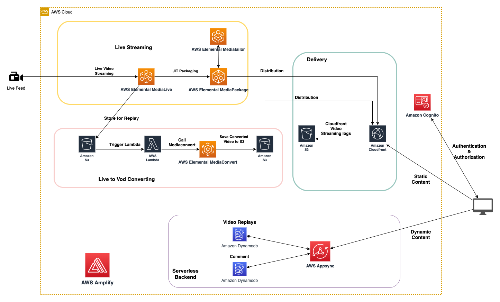
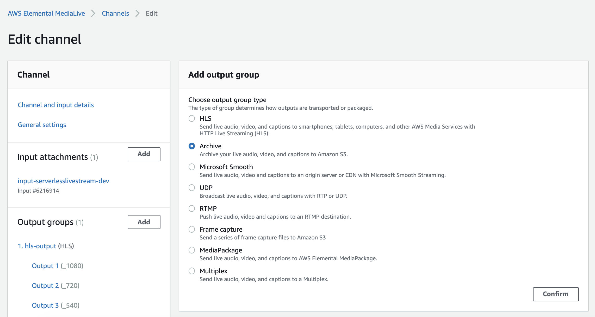
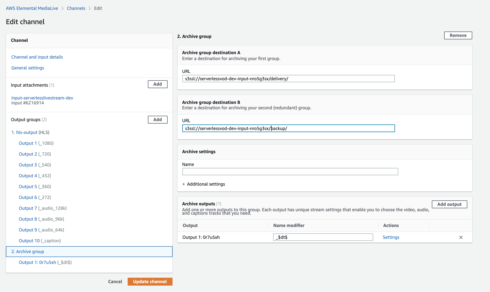
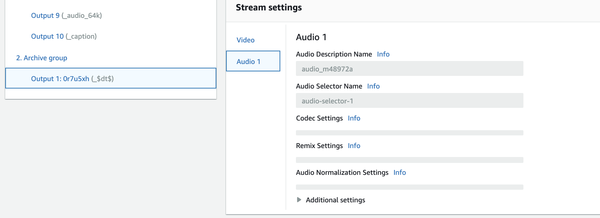
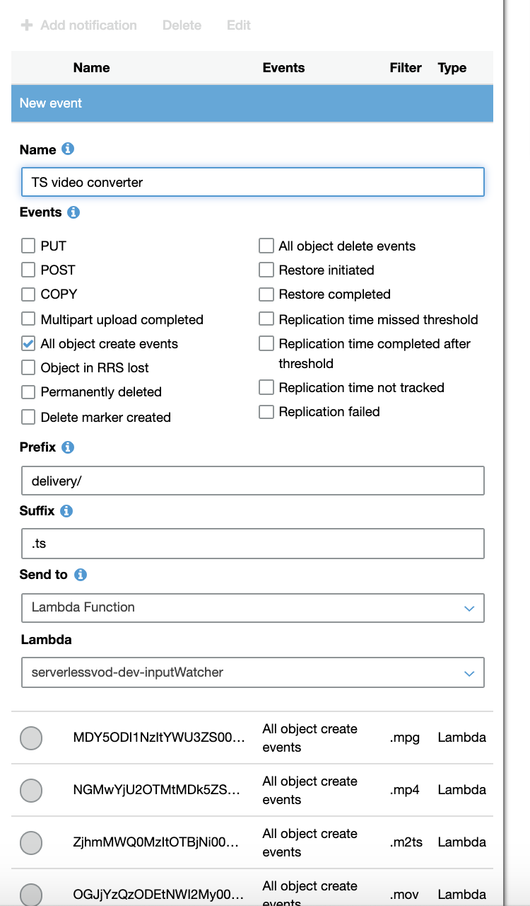
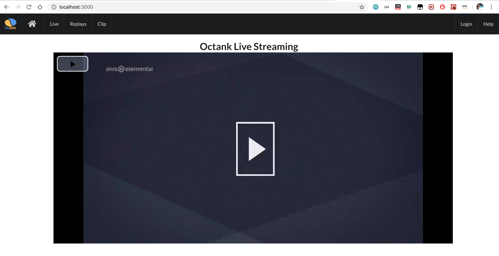
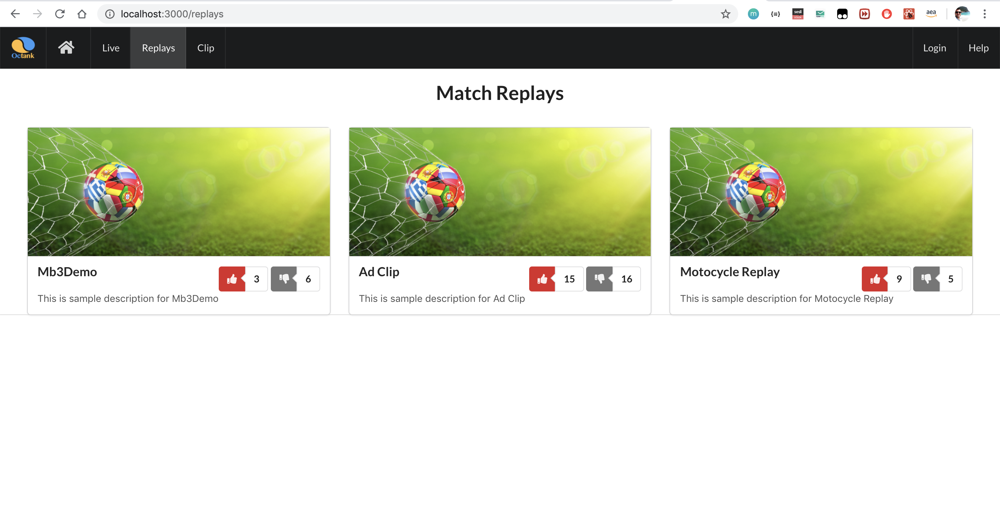
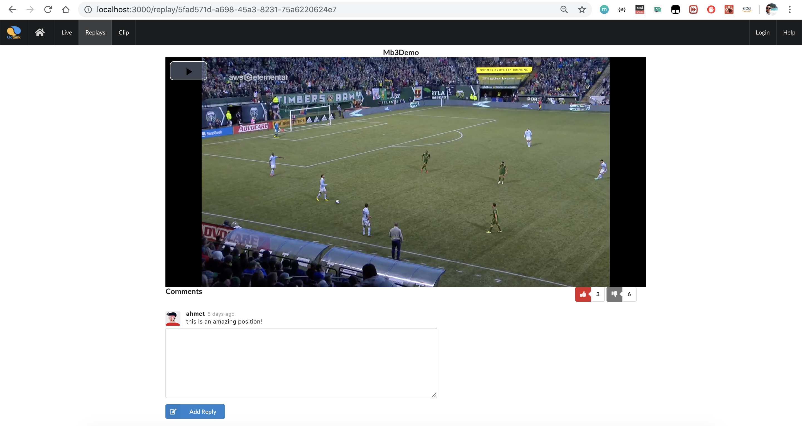
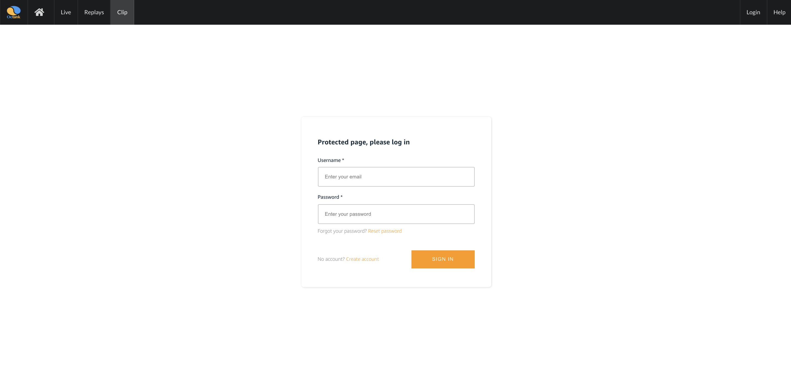
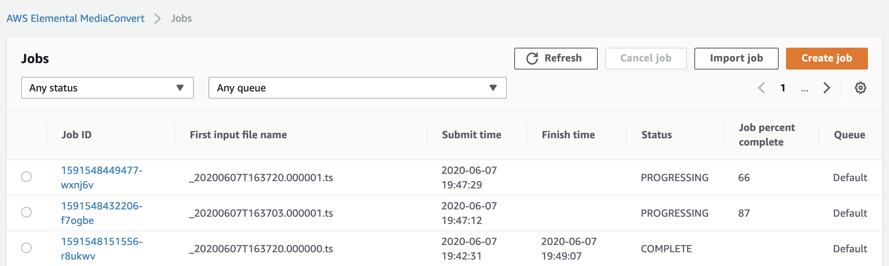

# Serverless Live Streaming
This is Live Streaming, VOD and Voting / Comment system which uses React, Amplify and Graphql with Appsync.



## Getting Started 
Install Npm dependencies

```bash
$ npm install

```

## Installing the CLI & Initializing a new AWS Amplify Project

### Installing the CLI

Next, we'll install the AWS Amplify CLI and Amplify Video package:

```bash
$ npm install -g @aws-amplify/cli
$ npm install -g amplify-category-video 
```

Now we need to configure the CLI with our credentials.

> If you'd like to see a video walkthrough of this configuration process, click [here](https://www.youtube.com/watch?v=fWbM5DLh25U).

```sh
$ amplify configure

- Specify the AWS Region: us-east-1 || us-west-2 || eu-central-1
- Specify the username of the new IAM user: amplify-cli-user
> In the AWS Console, click Next: Permissions, Next: Tags, Next: Review, & Create User to create the new IAM user. Then, return to the command line & press Enter.
- Enter the access key of the newly created user:   
? accessKeyId: (<YOUR_ACCESS_KEY_ID>)  
? secretAccessKey:  (<YOUR_SECRET_ACCESS_KEY>)
- Profile Name: amplify-cli-user
```

### Initializing Amplify

```bash
$ amplify init

- Enter a name for the project: serverlesslivestream
- Enter a name for the environment: dev
- Choose your default editor: Visual Studio Code (or your default editor)
- Please choose the type of app that youre building: javascript
- What javascript framework are you using: react
- Source Directory Path: src
- Distribution Directory Path: build
- Build Command: npm run-script build
- Start Command: npm run-script start
- Do you want to use an AWS profile? Y
- Please choose the profile you want to use: amplify-cli-user
```

The Amplify CLI has iniatilized a new project & you will see a new folder: __amplify__ & a new file called `aws-exports.js` in the __src__ directory. These files hold your project configuration.

To view the status of the amplify project at any time, you can run the Amplify `status` command:

```sh
$ amplify status
```

To view the amplify project in the Amplify console at any time, run the `console` command:

```sh
$ amplify console
```

## Adding a Cognito Authentication

To add a Cognito for User Authentication, we can use the following command:

```sh
$ amplify add auth

 Do you want to use the default authentication and security configuration:  Default configuration
 How do you want users to be able to sign in: Username
 Do you want to configure advanced settings? (Use arrow keys): No, I am done

```

## Adding a Live Streaming Video

To add a Video for Live Streaming, we can use the following command:

```sh
# This command will create S3 bucket for cloudfront logs
$ aws s3 mb s3://<PUT UNIQUE BUCKET NAME>(i.e. serverlesslivestream1234)

$ amplify add video

? Please select from one of the below mentioned services: Livestream
? Provide a friendly name for your resource to be used as a label for this category in the project: serverlesslivestream
? Do you want to modify any advanced video encoding parameters? No
? Input Security Group:  0.0.0.0/0
? MediaLive ingest type:  MP4_FILE
? Encoding Profile:  FULL (6 renditions)
? Auto Start:  Yes
? Provide URL to the MP4 file:  http://commondatastorage.googleapis.com/gtv-videos-bucket/sample/ElephantsDream.mp4
? Where do you want to stream to? MediaPackage
? Output streaming standards. MediaPackage supports HLS, DASH, MSS, and/or CMAF:  HLS
? Specify catch-up TV window:  86400
? Create distribution:  Yes
? Cloud Front Price Class:  Price Class 100
? S3 bucket for CloudFront Logs: (Must already exist):  <YOUR UNIQUE BUCKET NAME(i.e. serverlesslivestream1234)>
? S3 Prefix (Folder) for CloudFront logs:  cf_logs/
```

## Adding a VOD  

To add a Video for Video On Demand, we can use the following command:

```sh
$ amplify add video

? Please select from one of the below mentioned services: Video On Demand (beta)
? Provide a friendly name for your resource to be used as a label for this category in the project: serverlessvod
? Select a system-provided encoding template, specify an already-created template name:  Default Encoding Template (Apple HLS @ 1080p30)
? Is this a production enviroment? No
? Do you want Amplify to create a new GraphQL API to manage your videos? No
```

## Adding an AWS AppSync GraphQL API for Video Replays and  Comments

To add a GraphQL API, we can use the following command:

```sh
$ amplify add api

? Please select from one of the below mentioned services: GraphQL
? Provide API name: serverlesslivestream
? Choose the default authorization type for the API API key
? Enter a description for the API key: serverlesslivestream
? After how many days from now the API key should expire (1-365): 365
? Do you want to configure advanced settings for the GraphQL API No, I am done.
? Do you have an annotated GraphQL schema? No
? Do you want a guided schema creation? Yes
? What best describes your project: Single object with fields (e.g., “Todo” with ID, name, description)
? Do you want to edit the schema now? Yes
```

The CLI should open this GraphQL schema in your text editor.

__amplify/backend/api/serverlesslivestream/schema.graphql__

Update the schema to the following:   

```graphql
type Replay @model{
    id: ID!
    name: String!
    url: String!
    likes: Int!
    dislikes: Int!
    comments: [Comment] @connection(name: "ReplayComments")
}

type Comment @model {
    id: ID!
    content: String
    username: String!
    replay: Replay @connection(name: "ReplayComments")
}
```

### Deploying the Amplify resources

To deploy the Amplify resources, run the push command:

```
$ amplify push


✔ All resources copied.
✔ Successfully pulled backend environment dev from the cloud.
Current Environment: dev

| Category | Resource name                | Operation | Provider plugin   |
| -------- | ---------------------------- | --------- | ----------------- |
| Auth     | serverlesslivestream83a2c4e1 | Create    | awscloudformation |
| Video    | serverlesslivestream         | Create    | awscloudformation |
| Video    | serverlessvod                | Create    | awscloudformation |
| Api      | serverlesslivestream         | Create    | awscloudformation |

? Are you sure you want to continue? Y

# You will be walked through the following questions for GraphQL code generation

? Do you want to generate code for your newly created GraphQL API: Yes
? Choose the code generation language target: javascript
? Enter the file name pattern of graphql queries, mutations and subscriptions: src/graphql/**/*.js
? Do you want to generate/update all possible GraphQL operations - queries, mutations and subscriptions: Yes
? Enter maximum statement depth [increase from default if your schema is deeply nested]: 2
```

###### Update query
Once graphql folder can be created in above step, then add below query to the `src/graphql/queries.js`

```
export const getCommentByReplayId = /* GraphQL */ `
  query GetCommentByReplayId($id: ID!) {
    getReplay(id: $id) {
      comments {
        items {
          id
          content
          username
          createdAt
          updatedAt
        }
      }
    }
  }
`;
```


Now the Amplify Video, Auth and Api is deployed and you can start interacting with it!

### Some manual actions to forward streaming source to VOD
- Go to Elemental Medialive console, and select the channel which is created by Amplify, then Stop the channel
- Add second Output group as `Archive`
  
- Add the S3 Bucket URLs by created `Amplify Video OnDemand` module. Go the S3 Console, and get the bucket name.
   
- URLs must be started with `s3ssl://`.
- Add Audio option in Output of Archive group as well.
   
- Finally update the Channel and Start it.
- Go to S3 Console, and select the input VOD bucket which created by `Amplify Video OnDemand` module. Then, modify the S3 Event trigger path for delivery prevfx and suffix: `.ts` files.
  

 
## Start the Application
```
$ npm start
```

## Here is the UI from the app






Here is the Mediaconvert Job, triggered by Lambda when Medialive sends streaming to S3.

